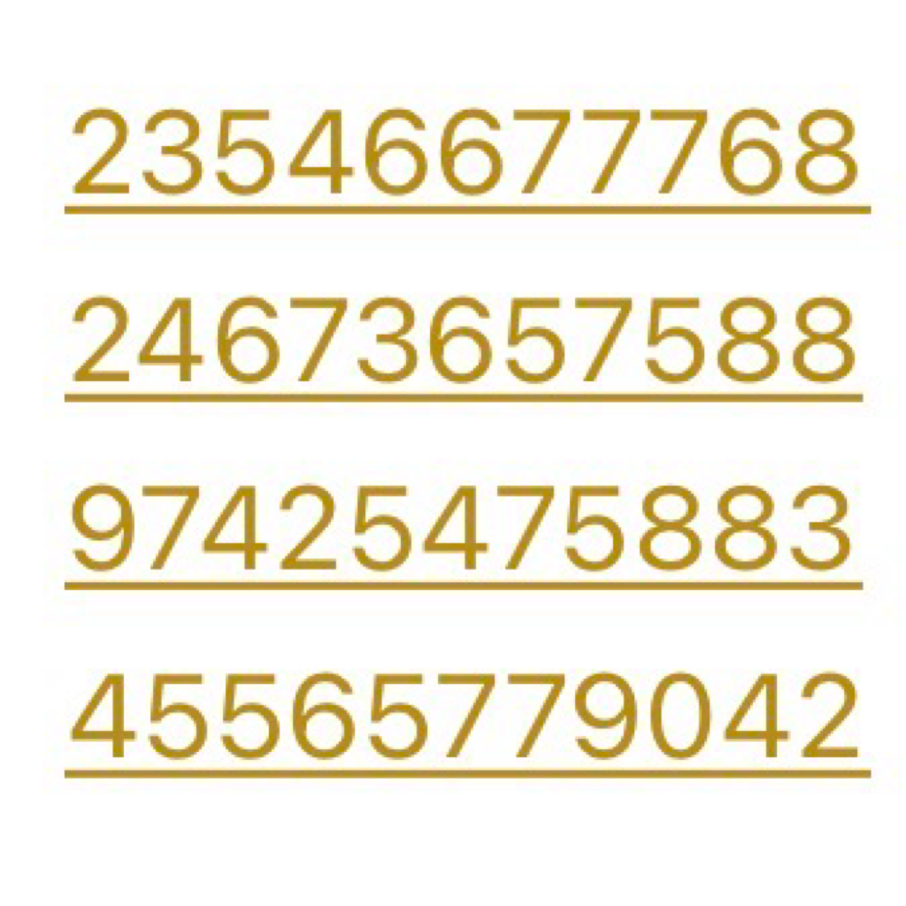

<p align="center">
  
</p>

<h1 align="center">CourrierCode</h1>

<p align="center">
  <strong>Encodez vos messages secrets en séquences numériques</strong>
</p>

<p align="center">
  <a href="https://apps.apple.com/app/courriercode">
    
  </a>
  
  
  
  
</p>

---

## 📱 À propos

**CourrierCode** est une application iOS qui transforme vos messages en codes numériques impossibles à déchiffrer sans connaître les règles secrètes. Parfaite pour les jeux de piste, chasses au trésor, ou simplement pour échanger des messages secrets avec vos proches !

<p align="center">
  
  
  
</p>

---

## ✨ Fonctionnalités

| Fonctionnalité | Description |
|----------------|-------------|
| 🔐 **Encodage** | Transformez n'importe quel texte en séquence de chiffres |
| 🔍 **Décodage** | Décryptez automatiquement les messages codés |
| �️ **Encodage d'images** | Transformez vos images en fichiers JSON codés |
| 📅 **Décalage quotidien** | Chaque jour utilise un décalage différent |
| 🔑 **Code secret** | Ajoutez une couche de sécurité supplémentaire |
| 🎲 **Table aléatoire** | Générez une table de correspondance personnalisée |
| 🔄 **Message inversé** | Option pour inverser le message final |
| 🌙 **Mode sombre** | Interface adaptée à vos préférences |
| 📖 **Documentation** | Guide intégré avec images zoomables |

---

## 🎯 Cas d'utilisation

- 🏴‍☠️ Jeux de piste et chasses au trésor
- 💬 Messages secrets entre amis
- 👨‍👩‍👧‍👦 Activités ludiques en famille
- 🚪 Défis d'escape game
- 🤫 Communication discrète

---

## 🛠 Installation pour les développeurs

### Prérequis

- macOS 14.0+
- Xcode 15.0+
- iOS 17.0+ (pour le déploiement)

### Cloner le projet

```bash
git clone https://github.com/boboul-cloud/CourrierCode.git
cd CourrierCode
```

### Ouvrir dans Xcode

```bash
open CourrierCode.xcodeproj
```

### Structure du projet

```
CourrierCode/
├── CourrierCode-iOS/
│   ├── ContentView.swift          # Vue principale
│   ├── CourrierCodeApp.swift      # Point d'entrée
│   ├── Components/                # Composants réutilisables
│   ├── Models/                    # Logique métier
│   │   ├── CourrierCodeur.swift   # Algorithme d'encodage
│   │   ├── Dictionnaire.swift     # Dictionnaire français
│   │   └── TableAleatoire.swift   # Génération de tables
│   ├── Theme/                     # Thème de l'application
│   └── Views/                     # Vues de l'application
├── Website/                       # Site web de support
└── AppStore/                      # Assets App Store
```

---

## 🔒 Comment ça marche ?

1. **Encodage** : Chaque lettre est convertie en nombre selon une table de correspondance
2. **Décalage** : Un décalage est appliqué selon le jour de la semaine
3. **Code secret** : Un code optionnel modifie la séquence finale
4. **Résultat** : Une séquence de chiffres séparés par des tirets

Exemple : `Bonjour` → `12-45-67-23-89-34-56`

---

## 🌐 Liens

- 📱 [App Store](https://apps.apple.com/app/courriercode)
- 🌍 [Site Web](https://boboul-cloud.github.io/CourrierCode)
- 📧 [Support](mailto:votre.email@example.com)
- 🔐 [Politique de confidentialité](Website/privacy.html)

---

## 📄 Licence

Ce projet est sous licence MIT. Voir le fichier [LICENSE](LICENSE) pour plus de détails.

---

## 🤝 Contribution

Les contributions sont les bienvenues ! N'hésitez pas à :

1. Fork le projet
2. Créer une branche (`git checkout -b feature/AmazingFeature`)
3. Commit vos changements (`git commit -m 'Add AmazingFeature'`)
4. Push sur la branche (`git push origin feature/AmazingFeature`)
5. Ouvrir une Pull Request

---

## 👨‍💻 Auteur

Développé avec ❤️ par **Robert Oulhen**

---

<p align="center">
  <sub>⭐ Si vous aimez ce projet, n'hésitez pas à lui donner une étoile !</sub>
</p>
